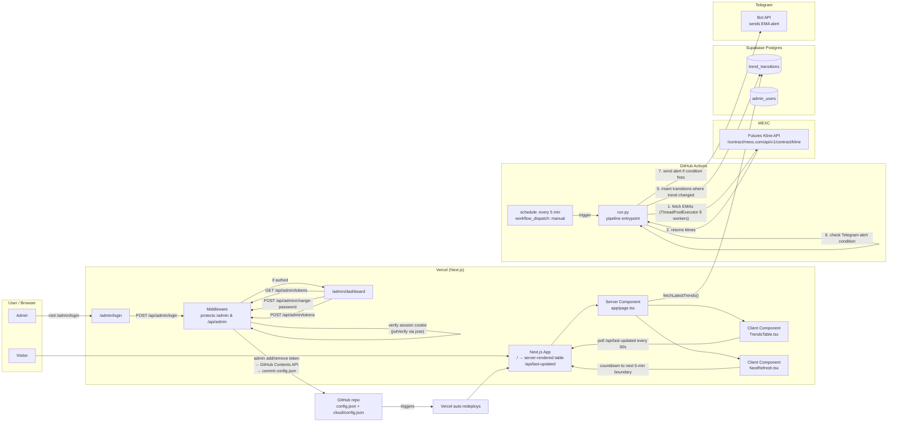
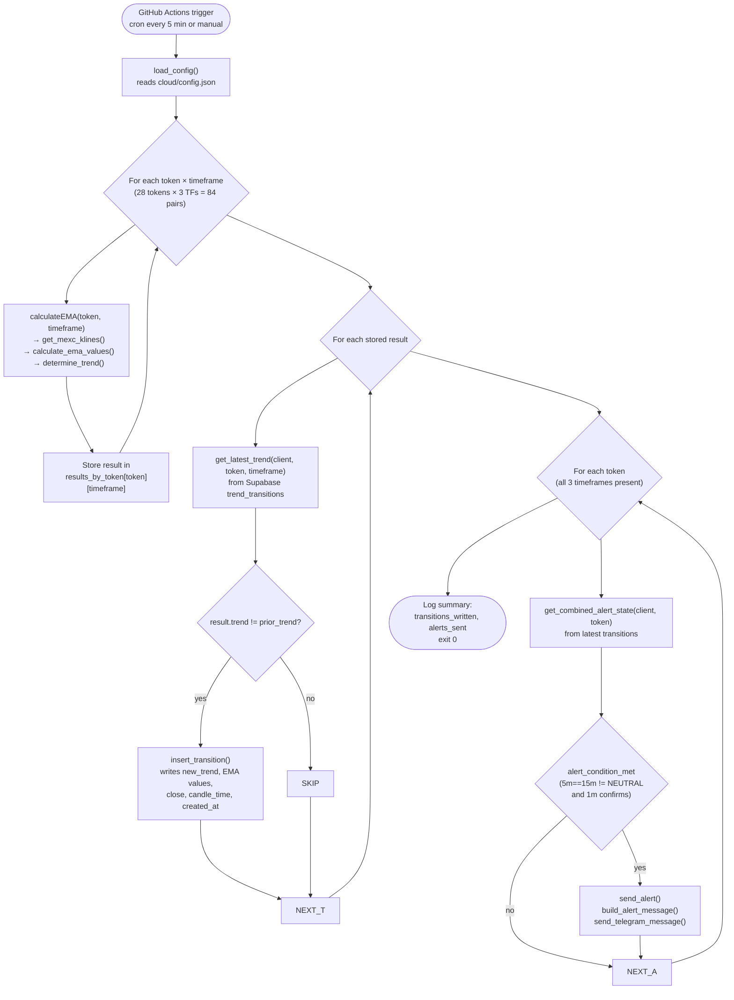
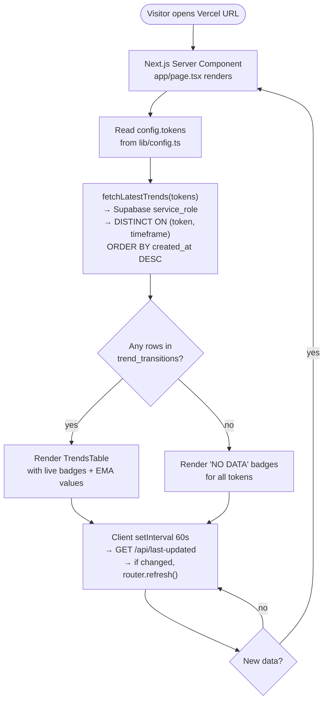
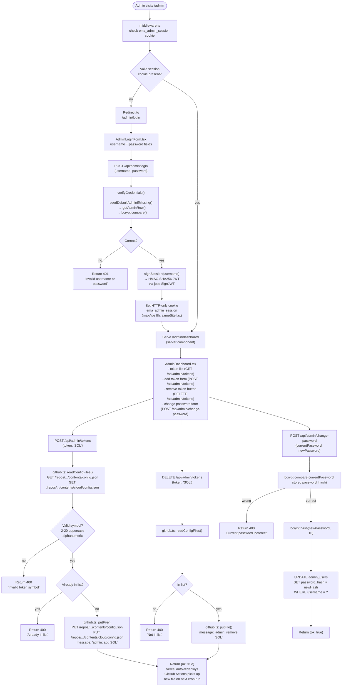
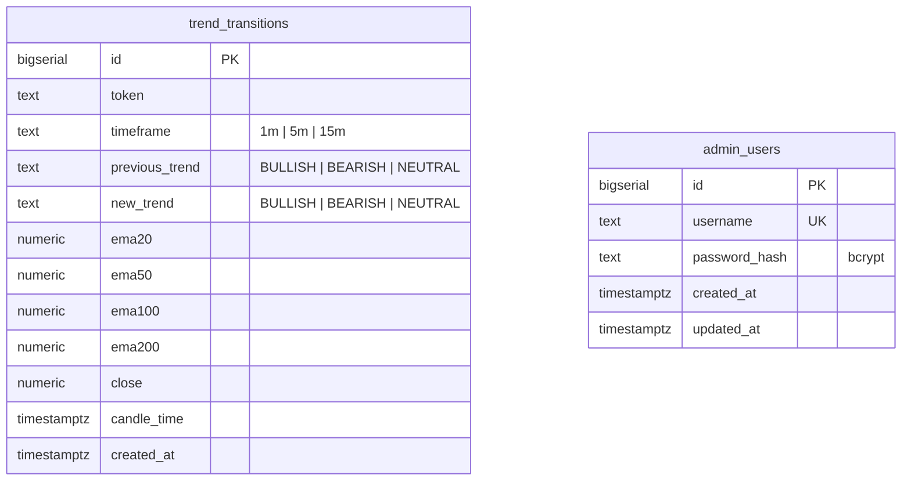

# System Architecture & Flow Charts

## 1. High-level architecture



## 2. GitHub Actions pipeline flow (one run)



## 3. First-visit user flow (public dashboard)



## 4. Admin authentication & token management flow



## 5. Data model relationships



## 6. File-to-route map

```
app/
  page.tsx                          → /
  layout.tsx                        → HTML shell
  globals.css                       → global styles
  api/
    last-updated/route.ts           → GET /api/last-updated
    admin/
      login/route.ts                → POST /api/admin/login
      logout/route.ts               → POST /api/admin/logout
      me/route.ts                   → GET /api/admin/me
      change-password/route.ts      → POST /api/admin/change-password
      tokens/route.ts               → GET/POST/DELETE /api/admin/tokens
  admin/
    page.tsx                        → /admin (redirect)
    login/page.tsx                  → /admin/login
    dashboard/page.tsx              → /admin/dashboard

components/
  TrendsTable.tsx                   → main dashboard table (client)
  TrendBadge.tsx                    → colored trend badge
  DetailRow.tsx                     → expandable EMA detail panel
  NextRefresh.tsx                   → countdown timer (client)
  AdminLoginForm.tsx                → login form (client)
  AdminDashboard.tsx                → admin CRUD UI (client)

lib/
  trends.ts                         → TypeScript types (TokenTrend, TimeframeState)
  data.ts                           → Supabase fetch (server-side, service role)
  supabase.ts                       → server Supabase client
  supabase-browser.ts               → browser Supabase client (anon key)
  admin.ts                          → session, login, password, seed admin
  github.ts                         → GitHub Contents API client
  config.ts                         → static app config (tokens, timeframes)

cloud/
  config.json                       ← mirrors repo-root config.json
  config_loader.py                  → loads cloud/config.json
  mexc.py                           → MEXC klines + EMA math
  supabase_client.py                → Supabase writes + reads
  telegram.py                       → Telegram alert builder + sender
  run.py                            → entrypoint: fetch → compare → write → alert

supabase/migrations/
  0001_init.sql                     → trend_transitions table + indexes + RLS
  0002_admin.sql                    → admin_users table + RLS

middleware.ts                       → protects /admin and /api/admin routes
vercel.json                         → forces Next.js framework detection
```

## 7. Timing diagram (steady state)

```mermaid
gantt
    title Steady-state timeline (GitHub Actions + Vercel + Client)
    dateFormat  s
    axisFormat %M:%S

    section GitHub Actions
    Run #1 (fetch 84 pairs)     :a1, 0, 60s
    Gap until next trigger      :a2, after a1, 60s
    Run #2 (fetch 84 pairs)     :a3, after a2, 60s
    Gap until next trigger      :a4, after a3, 60s

    section Vercel (server)
    SSR render (revalidate=60)  :v1, 0, 5s
    Idle until revalidate       :v2, after v1, 55s
    SSR render (revalidate=60)  :v3, after v2, 5s

    section Browser (client)
    Poll /api/last-updated      :c1, 0, 60s
    Poll /api/last-updated      :c2, 60s, 60s
    Poll /api/last-updated      :c3, 120s, 60s
    router.refresh() on change  :crit, after c3, 0s
```

## 8. Environment variables reference

| Variable | Where set | Used by | Purpose |
|---|---|---|---|
| `SUPABASE_URL` | Vercel + GitHub | pipeline + web | Supabase project URL |
| `SUPABASE_SERVICE_ROLE_KEY` | Vercel + GitHub | pipeline + web | Server-side Supabase access |
| `NEXT_PUBLIC_SUPABASE_URL` | Vercel only | web (browser) | Supabase URL for anon client |
| `NEXT_PUBLIC_SUPABASE_ANON_KEY` | Vercel only | web (browser) | Anon key for RLS reads |
| `TELEGRAM_BOT_TOKEN` | GitHub only | pipeline | Telegram bot token |
| `TELEGRAM_CHAT_ID` | GitHub only | pipeline | Telegram target chat |
| `ADMIN_SESSION_SECRET` | Vercel only | web (server) | HMAC secret for session cookies |
| `GITHUB_TOKEN` | Vercel only | web (server) | GitHub PAT for Contents API |
| `GITHUB_REPO_OWNER` | Vercel only | web (server) | GitHub username/org |
| `GITHUB_REPO_NAME` | Vercel only | web (server) | Repo name |
| `GITHUB_REPO_BRANCH` | Vercel only | web (server) | Branch (defaults to `main`) |
